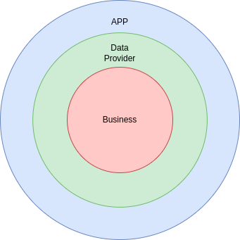
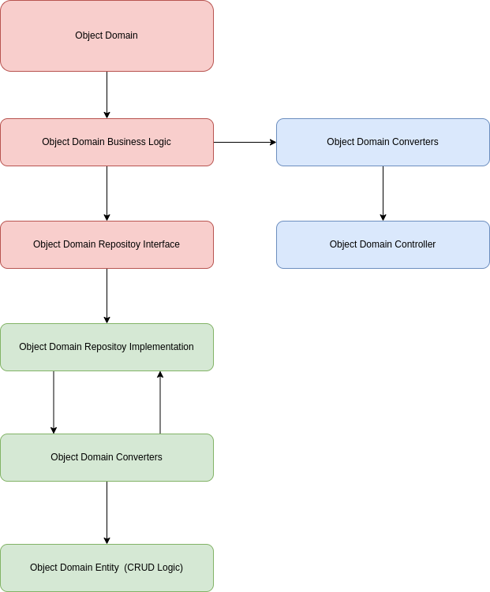
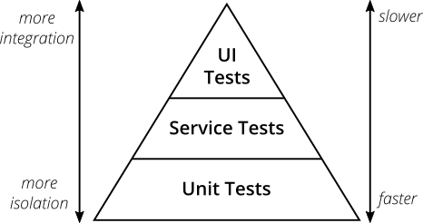

# Liberty Interview Challenge

This project cover all the detected user cases, also  should create a quick implementation of the SpringBoot application.

### Pre-requisites:
* IntelliJ Lombok plugin
* Java 11
* Maven

OBS: The default database is H2, a database in memory. About more [h2](https://www.baeldung.com/spring-boot-h2-database)

#### Service architecture

## Onion Architecture

 

This project is based on onion architecture, an architecture proposed by [Jeffrey Palermo](https://jeffreypalermo.com/2008/07/the-onion-architecture-part-1/)
so, we can see different directories here., let me explain:

- **app**: Receives sync requests, and the runtime app;
- **business**: There is all the business logic;
- **data-provider**: Stores database migrations, and the entities used in the whole service as well;

### How the modules do communicate

## TDD
Was used great practice from the tests, based on The Practical Test Pyramid from [Martin Fowler](https://martinfowler.com/articles/practical-test-pyramid.html)

### Libs used
- Unit test: jUnit 5 
- Integration Test: Spring Boot Tests
- E2E: REST-assured:

To run the test just execute the command:

`make run-test`

## Endpoints

To see the endpoint doc you can access
http://localhost:9958/swagger-ui/index.html#/

## Running the project

### Run the project with h2 database

`make run-app-with-h2`

### Run the project with postgres database

`make run-app-with-postgres`

